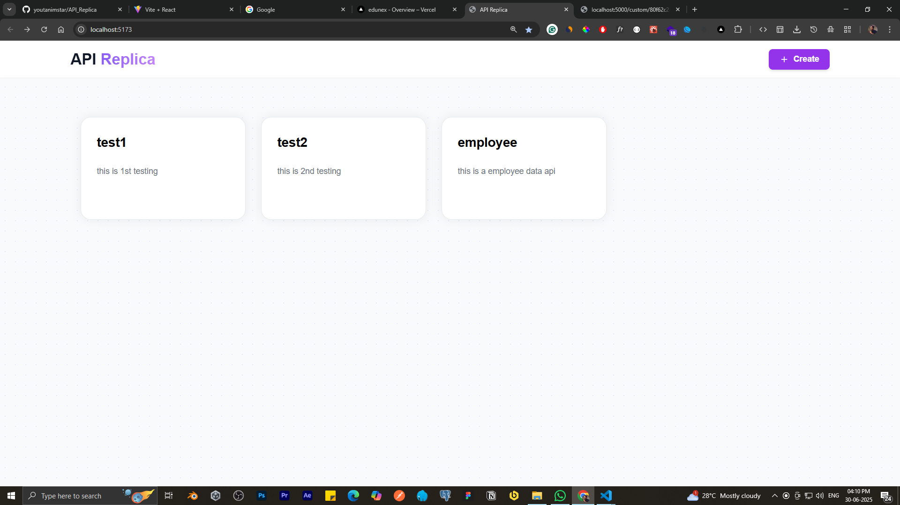
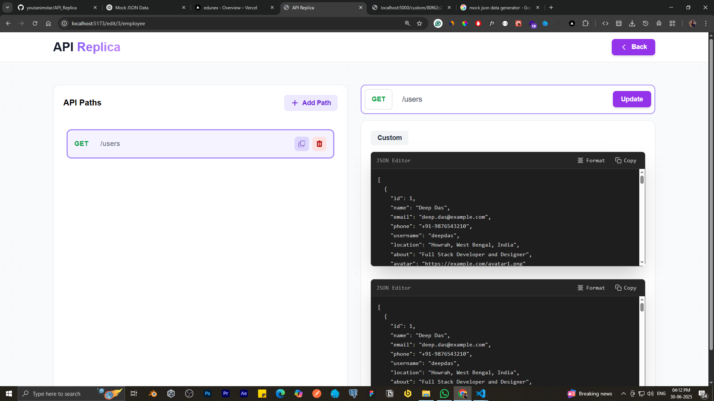
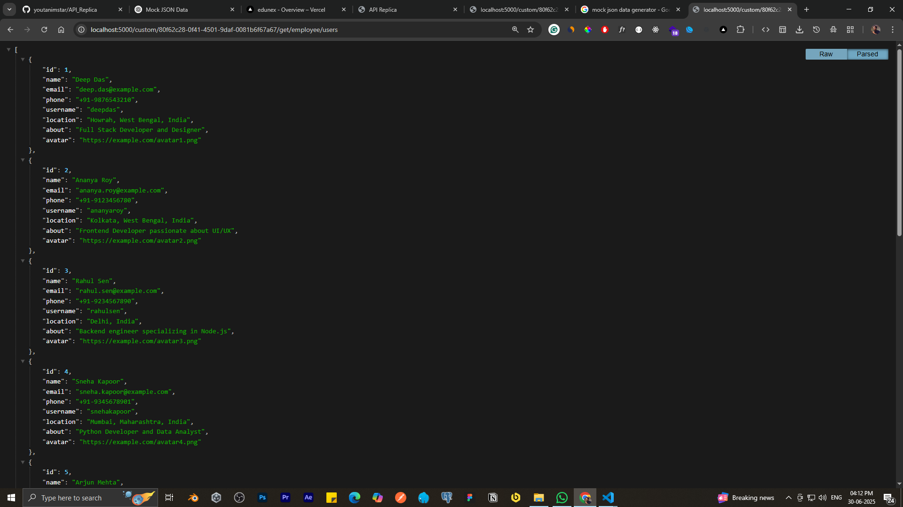

# 🚀 API Replica

<div align="center">
  
  <br>
  
  
  
  
</div>

## 📖 Overview

**API Replica** is a powerful, user-friendly platform that allows developers to create, manage, and test custom APIs with ease. Built with modern web technologies, it provides a seamless experience for API development and testing with real-time JSON editing capabilities.

### ✨ Key Features

- 🎯 **Custom API Creation** - Build and configure your own REST APIs
- 🛠️ **Real-time JSON Editor** - Edit API responses with live preview
- 📱 **Responsive Design** - Beautiful UI that works on all devices
- 🔄 **Live Testing** - Test your APIs instantly with built-in tools
- 💾 **Data Persistence** - Store and manage your API configurations
- 🎨 **Modern UI** - Clean, intuitive interface built with React & Tailwind CSS

## 🖼️ Gallery

### 📸 Application Screenshots

<div align="center">

#### 🏠 Home Dashboard

*Main dashboard showing available APIs and quick actions*

#### ⚙️ API Configuration

*Detailed API configuration interface with JSON editor*

#### 🧪 Live API Testing

*Real-time API testing with response preview*

</div>

## 🏗️ Architecture

```
```plaintext
API_Replica/
├── frontend/                # 💻 React + Vite frontend
│   ├── public/              # 🖼️ Static assets (images, favicon, etc.)
│   ├── src/
│   │   ├── assets/          # 🗂️ Images, icons, etc.
│   │   ├── components/      # 🧩 Reusable UI components (Navbar, Cards, Editors)
│   │   ├── pages/           # 📄 Page components (Home, EditApi, etc.)
│   │   ├── styles/          # 🎨 Tailwind CSS and custom styles
│   │   └── main.jsx         # 🚪 App entry point
│   └── vite.config.js       # ⚙️ Vite configuration
├── backend/                 # 🖥️ Node.js + Express backend
│   ├── controllers/         # 🧠 API logic controllers
│   ├── models/              # 🗃️ Sequelize models (database schemas)
│   ├── routes/              # 🛣️ API & custom route definitions
│   ├── config/              # 🔧 Database and environment config
│   ├── migrations/          # ⬆️ Database migrations (if any)
│   ├── seeders/             # 🌱 Database seeders (if any)
│   ├── app.js               # 🚦 Express app entry point
│   └── .env                 # 🗝️ Environment variables
├── images/                  # 🖼️ Project images for documentation
├── README.md                # 📘 Project documentation
├── package.json             # 📦 Project metadata and scripts (root or per workspace)
└── LICENSE                  # 📄 Project license
```


## 🚀 Quick Start

### Prerequisites

- 
- 
- 

### 🔧 Installation

1. **Clone the repository**
   ```bash
   git clone https://github.com/youtanimstar/API_Replica.git
   cd API_Replica
   ```

2. **Setup Backend**
   ```bash
   cd backend
   npm install
   npm start
   ```

3. **Setup Frontend**
   ```bash
   cd frontend
   npm install
   npm run dev
   ```

4. **Configure Environment**
   ```bash
   # Create .env file in backend directory
   DB_HOST=localhost
   DB_USER=your_username
   DB_PASSWORD=your_password
   DB_NAME=mag
   PORT=5000
   ```

### 🌐 Access the Application

- **Frontend**: `http://localhost:5173`
- **Backend API**: `http://localhost:5000`

## 🛠️ Tech Stack

| Category | Technology |
|----------|------------|
| **Frontend** |   |
| **Styling** |  |
| **Backend** |  |
| **Database** |  |
| **Tools** |   |

## 📚 API Documentation

### 🔗 Endpoints

| Method | Endpoint | Description |
|--------|----------|-------------|
| `GET` | `/api/custom/:id` | Retrieve custom API data |
| `POST` | `/api/custom` | Create new custom API |
| `PUT` | `/api/custom/:id` | Update existing API |
| `DELETE` | `/api/custom/:id` | Delete custom API |

### 📝 Sample Request
```javascript
// GET /api/custom/employee
{
  "id": 1,
  "name": "Deep Das",
  "email": "deep.das@example.com",
  "phone": "+91-9876543210",
  "username": "deepdas",
  "location": "Howrah, West Bengal, India",
  "about": "Full Stack Developer and Designer"
}
```

## 🤝 Contributing

We welcome contributions! Please see our [Contributing Guidelines](CONTRIBUTING.md) for details.

1. Fork the repository
2. Create your feature branch (`git checkout -b feature/AmazingFeature`)
3. Commit your changes (`git commit -m 'Add some AmazingFeature'`)
4. Push to the branch (`git push origin feature/AmazingFeature`)
5. Open a Pull Request

## 👨‍💻 Developer

<div align="center">
  
  
  ### **Deep Das**
  *Full Stack Developer & Designer*
  
  [](https://github.com/youtanimstar)
  [](https://www.linkedin.com/in/thedeepdas/)
  [](mailto:deepdas.it34@gmail.com)
  [](https://deepdas-portfolio.netlify.app/)
  
  **📍 Location:** Howrah, West Bengal, India  
  **💼 Expertise:** React, Node.js, Full Stack Development, API Design  
  **🎯 Passion:** Building scalable web applications and beautiful user interfaces
</div>

## 📄 License

This project is licensed under the **MIT License** - see the [LICENSE](LICENSE) file for details.

## 🙏 Acknowledgments

- React.js community for the amazing framework
- Tailwind CSS for the utility-first CSS framework
- Express.js for the robust backend framework
- MySQL for reliable data storage
- All contributors who helped make this project better


---

<div align="center">
  <p>Made with ❤️ by <strong>Deep Das</strong></p>
  <p>⭐ If you found this project helpful, please give it a star!</p>
</div>